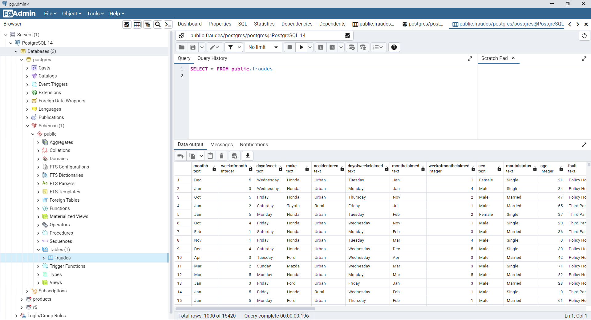
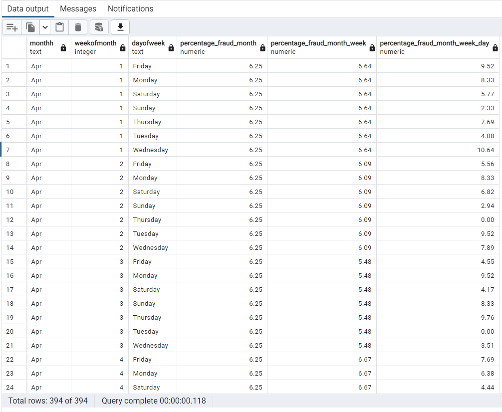

# PRUEBA DATA SCIENTIST R5 #
#####  Jose Luis Cabrera Vega

Los principales proyectos de R5 vienen encaminados al sector vehículos. Usted deberá apoyarse de sus conocimientos para cumplir el siguiente objetivo:

* **Reducir perdidas por fraude en las reclamaciones de siniestro**

## Importancia del modelo en el negocio

Para R5 es de gran importancia un modelo que realice la predicción de fraude, esto debido a que mitigaría los costos asociados a cubrimiento del seguro por eventos que no fueron accidentes si no posiblemente provocados.

Por una parte, el modelo de predicción de fraudes una vez reportado y dispuesto en las bases de datos, puede ser analizado por el modelo de machine learning, logrando predecir si este evento es un posible fraude.

Detectar fraude desde el momento que el evento es reportado puede ayudar a la entidad a enfocar esfuerzos en la investigación de dicho evento y no en aquellos que no son fraudes ahorraría costos y enfocaría esfuerzos en los eventos con mayor probabilidad. 

Una vez detectado un evento fraudulento y tomando acciones al respecto conllevaria a una disminución de los costos que son derivados el evento.

De manera adicional juntando el tema de la modelación y el negocio se pueden agregar reglas del negocio desde la experiencia de las áreas de la entidad vinculadas al sector de vehículos, mejorando la precisión del modelo y disminuyendo la cantidad de falsos positivos.

## Intrucciones proyecto
A continuación encontrara las instrucciones para entender y ejecutar el proyecto:

1. Se crearon 3 Jupyter Notebook, en los cuales se encontrara:
    * Creando_DataBase: Realiza la construcción de la base de datos de manera local en postgresql (Se debe tener instalado postgresql).
    * DS_R5_EDA_Encoder: Contiene la conexión con la base de datos, analisis estadistico descriptivo, conclusiones generales y encoding de las variables para entrar al modelo.
    * DS_R5_Model: Contiene el modelo de Machine Learning con la evaluación de algunas metricas importantes.

2. El **archivo requierements.txt** contiene las librerias y versiones utilizadas en el proyecto.

3.  **Base de Datos** Se requiere conexión con la base de datos para obtener la información de análisis Si se requiere crear la base de datos se puede correr el Jupyter **Creando_DataBase**

4.  **Consulta a base de datos** La salida especifica solicitada se encuentra en el archivo *notebooks/Creando_DataBase* donde se puede ver el query utilizado para realizar la salida, esta directamente desde POSTGRESQL

5.  **Análisis Descriptivo** Se puede encontrar el analisis descriptivo y conclusiones en  *notebooks/Creando_DataBase*

6.  **Encoding** Se puede observar las variables transformadas las cuales ingresan al modelo en  *notebooks/DS_R5_EDA_Encoder*

7.  **Modelado** Todo el proceso de modelado, revisión de metricas, importancia de las variables. se pueden encontrar en   *notebooks/DS_R5_Model*

8.  **Archivos solicitados** *train* y *predict* se encuentran directamente en la ruta principal.